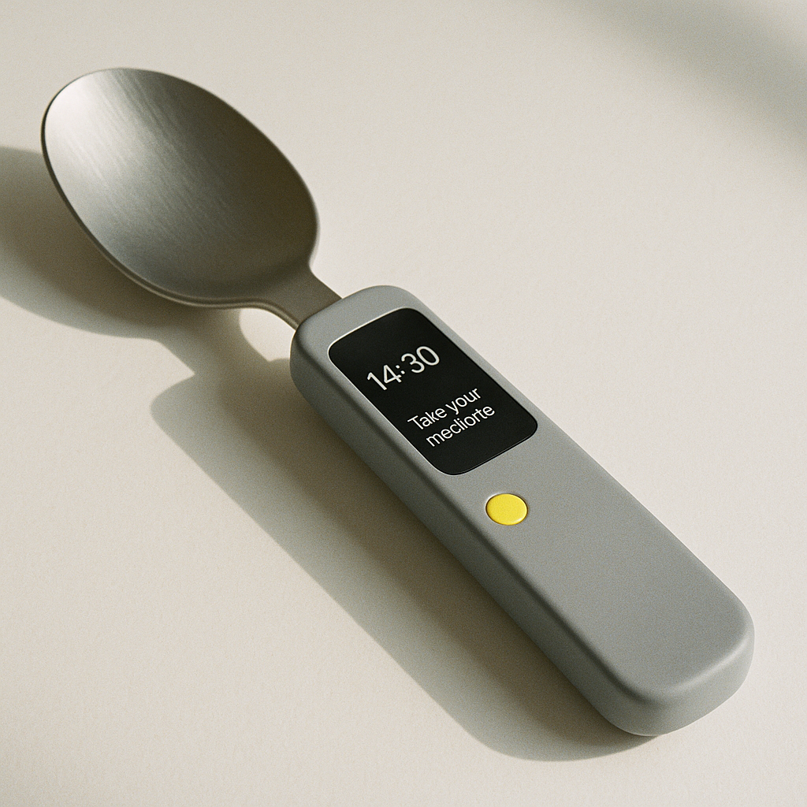
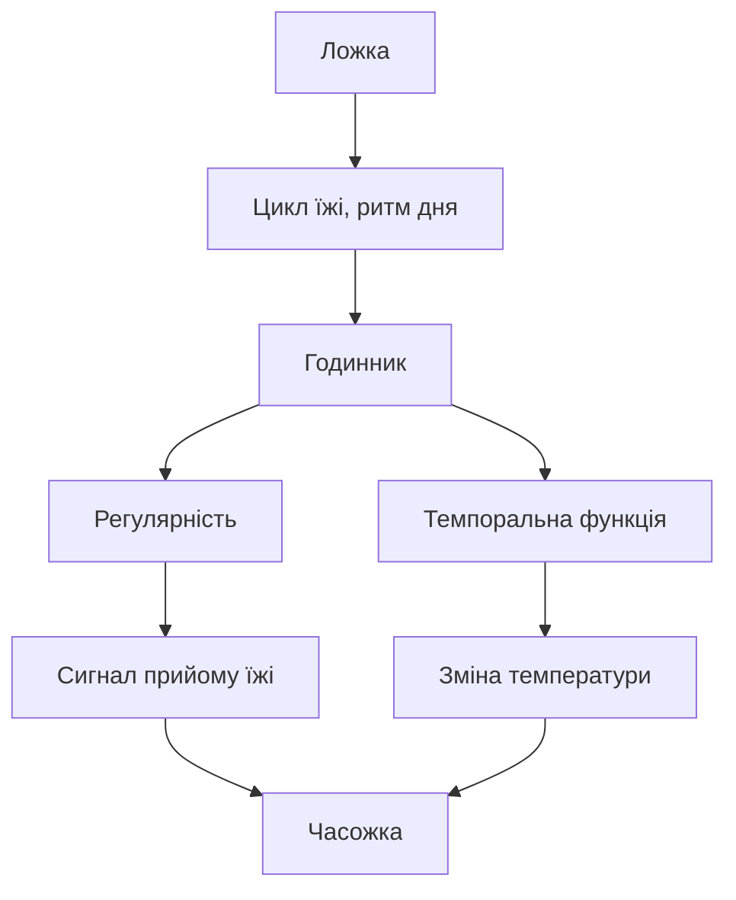

Розумна ложка, яка проектує або показує дані про їжу в ній або змінює колір як індикатор, що час зробити певну дію. Підказує, коли пора їсти або приймати ліки. Можливий застосунок у лікарнях чи догляді за дітьми.

# Бісоціації

# Посилання

- [Презентація «Паперові комп'ютери проти ШІ»](https://www.figma.com/deck/rrg09AudnmAHtjrjpfs5gA)
- [The Act of Creation, Arthur Koestler.pdf](https://ia601307.us.archive.org/33/items/pdfy-rDIHDXbS3uvtgXcr/The%20Act%20of%20Creation%2C%20Arthur%20Koestler.pdf)