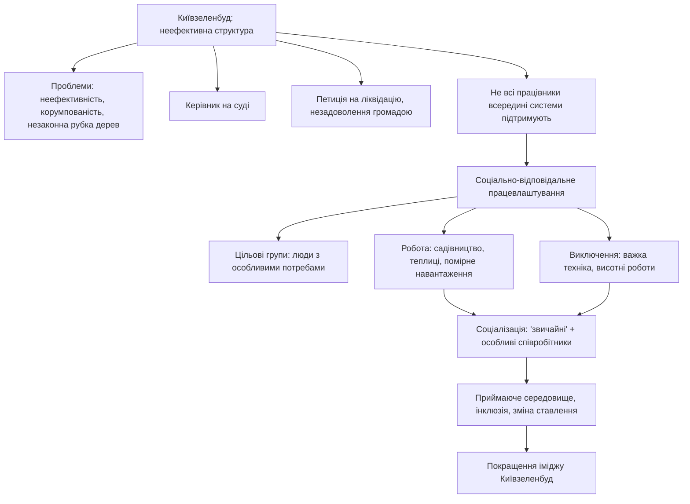

Перетворити Київзеленбуд у соціально-відповідальне підприємство, що працевлаштовує людей із особливими потребами (синдром Дауна, інвалідність тощо). Це створить приймаюче середовище, де вони можуть займатися садівництвом і працювати у теплицях із помірним фізичним навантаженням. Така модель підвищить соціальну інклюзію, покаже справжніх людей у системі, розвіяє стереотипи та збільшить довіру до організації.

# Бісоціації

# Посилання

[Презентація «Паперові комп'ютери проти ШІ»](https://www.figma.com/deck/rrg09AudnmAHtjrjpfs5gA)
[The Act of Creation, Arthur Koestler.pdf](https://ia601307.us.archive.org/33/items/pdfy-rDIHDXbS3uvtgXcr/The%20Act%20of%20Creation%2C%20Arthur%20Koestler.pdf)