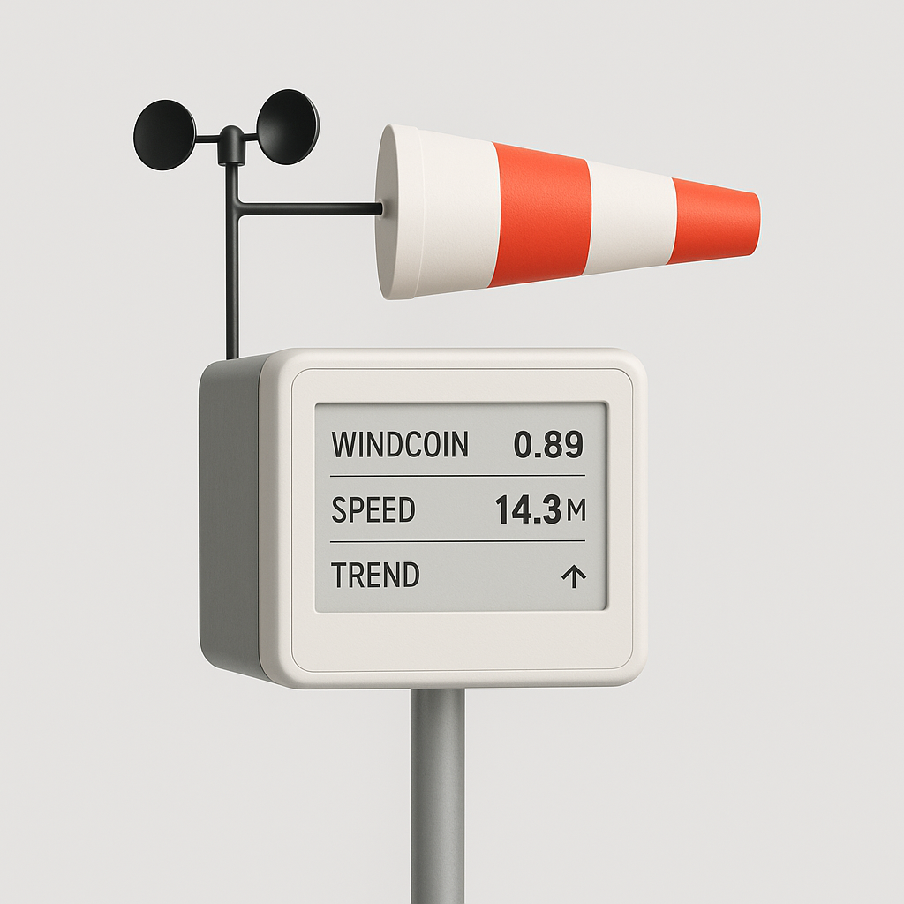
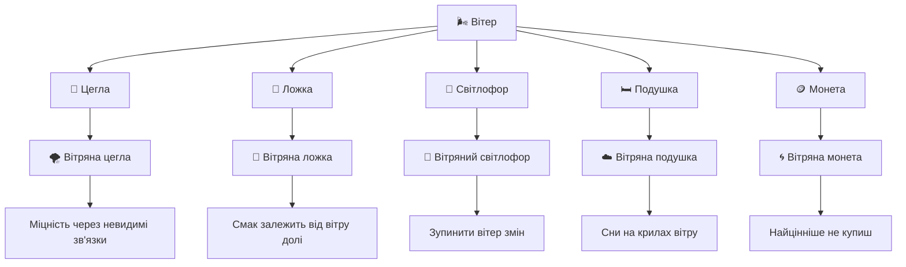

Пристрій, який:

- фіксує швидкість і напрямок вітру (анемометр + рукав),
- виводить курс локальної "вітрової валюти",
- є публічним елементом інфраструктури — щось середнє між годинником, метеостанцією та банкоматом.



# Загальний вигляд

- **Форма корпусу:** Прямокутний або циліндричний, з алюмінієвим матовим корпусом, з білими або світло-сірими пластиковими вставками.
- **Вітровий рукав:** Виходить з верхньої частини пристрою, як у метеостанціях на летовищах. Рукав виконаний в мінімалістичних кольорах: біло-сірий з однією яскравою лінією (жовта або червона).
- **Анемометр:** Три або чотири чорні чашечки, прикріплені до тонкого металевого стержня, обертаються вгорі чи збоку пристрою.
- **Основа:** Встановлений на тонкій сталевій трубі або консольному кронштейні — можна прикріпити до стіни або стоїть окремо на площі.

# Як виглядає табло?

```
WINDCOIN: +3.45% ↑    |   SPEED: 12.7 M/S → NE    |    AIR MARKET STABLE
```

- бігуча стрічка (LED), червоні або янтарні пікселі на чорному фоні, як на старих біржах або вокзалах;
- Мінімалістичний LCD як у Braun калькуляторах;
- Електронне чорнило (e-ink display), що пасує до екологічного стилю пристрою.

Робочі назви _"АероЦентавр"_ або _"WindUnit-01"_ .

# Бісоціації

