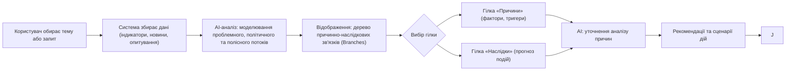

На основі моделі, запропонованої Джоном Кінгдоном у 1984 — політичне вікно можливостей (англ. _policy window_, _window of opportunity_) визначає три потоки, які зазвичай спостерігаються окремо: проблемний потік, політичний потік та потік ініціатив чи законопроєктів. Коли ці три потоки збігаються, відкривається «політичне вікно можливостей». Це момент, коли запит на зміну, політична воля та готові рішення зустрічаються.


# Базовий флоу

Хоча користувач і може бути технічно підкованим, але все ж варто зменшувати тертя та зробити його доступним на всіх пристроях.



# Лоуфай інтерфейс

Інтерфейс заснований на дизайн-паттерні «Гілки» (Branches) для дослідження ланцюгів причин та наслідків.

Основна мета — надати користувачам (активістам, журналістам, аналітикам) зрозумілу картину поточного стану й перспектив, а також інтерактивні рекомендації та сценарії дій для максимально ефективного впливу.

```
┌────────────────────────────────────────────────────────────┐
│ [🔍 Виберіть тему або запит]                               │
│   (приклад: "Публічні закупівлі в освіті")                 │
├────────────────────────────────────────────────────────────┤
│ ● Поточний статус:                                         │
│   📉 Проблема: високий рівень корупції в регіонах          │
│   📊 Політичний клімат: обговорюється новий законопроєкт  │
│   📎 Рішення: є альтернативи від ГО та депутатів           │
│   🔓 Вікно можливостей: ВІДКРИТЕ 🟢 (ймовірність 76%)       │
├────────────────────────────────────────────────────────────┤
│        ГРАФ ПРИЧИН І НАСЛІДКІВ (Branches Pattern)          │
│                                                            │
│        [💥 Низька прозорість]                              │
│             ↓                                              │
│        [👤 Низький громадський контроль]                   │
│             ↓                                              │
│        [💸 Зловживання на рівні закупівель]                │
│             ↓                                              │
│        [📉 Зниження якості освіти]                         │
│                                                            │
│   [Показати →] альтернативні сценарії дій                  │
│                                                            │
├────────────────────────────────────────────────────────────┤
│        📬 Рекомендовані дії                                │
│                                                            │
│   ✅ Вікно у Раді: законопроєкт 9283 на розгляді           │
│   ✅ Подати звернення (шаблон від ГО "Прозора школа")      │
│   ✅ Публікація: згенерувати пост для соцмереж             │
│                                                            │
│   [⚙️ Налаштувати сценарії дій]   [📤 Експортувати]         │
├────────────────────────────────────────────────────────────┤
│ 🤖 AI-коментар:                                             │
│  “Це питання перебуває у фокусі громадських організацій,   │
│   ймовірне ухвалення закону найближчим часом.              │
│   Підтримка ЗМІ може посилити тиск на депутатів.”          │
├────────────────────────────────────────────────────────────┤
│ 👁 Показати джерела даних (індикатори, цитати, джерела)    │
└────────────────────────────────────────────────────────────┘
```


# Джерела 
- [John W. Kingdon — *Agendas, Alternatives, and Public Policies* (Multiple Streams Framework)](https://www.pearson.com/en-us/subject-catalog/p/agendas-alternatives-and-public-policies/P200000003222/9780205000869)
- [Maggie Appleton — *LM Sketchbook: Patterns for UI and UX with Language Models*](https://maggieappleton.com/lm-sketchbook)
- [Civic Tech Field Guide — *Design Principles for Civic Tech Projects*](https://civictech.guide/resource/design-principles-for-civic-tech-projects/)
- [Balbek Bureau — *RE:Ukraine Villages and Regions Project*](https://www.balbek.com/reukraine-villages-regions)
- [Dieter Rams — *Ten Principles of Good Design*](https://www.vitsoe.com/rw/about/good-design)
- [Civic Tech Field Guide — *AI & Democracy*](https://civictech.guide/topic/ai-democracy/)[OpenAI — *ChatGPT UI Patterns & Language Model Interfaces (via API/Notebook LM)*](https://openai.com/blog/chatgpt-plugins)
- [Google — *NotebookLM* (приклад інтерфейсу роботи з потоками знань)](https://notebooklm.google.com/)
