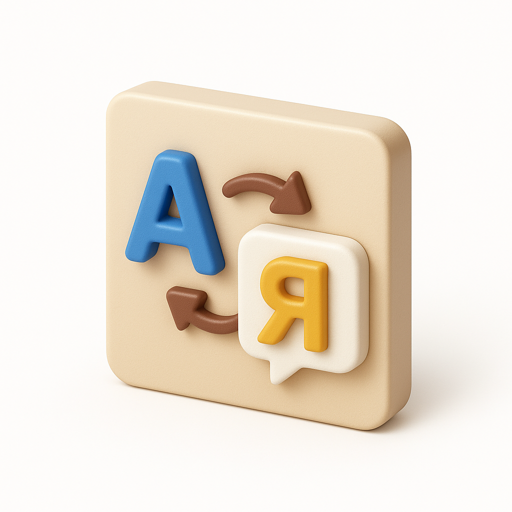

Допомагає оформити звернення майже в будь-яку установу і робить те з дуже серйозним виразом обличчя та усіма згідно-з-відповідно-до. Бо тільки но вато замислитись над бюрократичною безодньою — вона почне дивитись на тебе і всі бажання зав'янули, що ті чорнобривці на шкільному майданчику в +40. 

# Прототип
https://huggingface.co/spaces/andriiloginov/shabot

Зараз працюю над:

- покращенням системних промптів;
- варіативністю;
- пошуком по законодавчій базі;
- збереженням історії повідомлень;
- новим інтерфейсом;
- формуванням документів;
- ви мені скажіть.