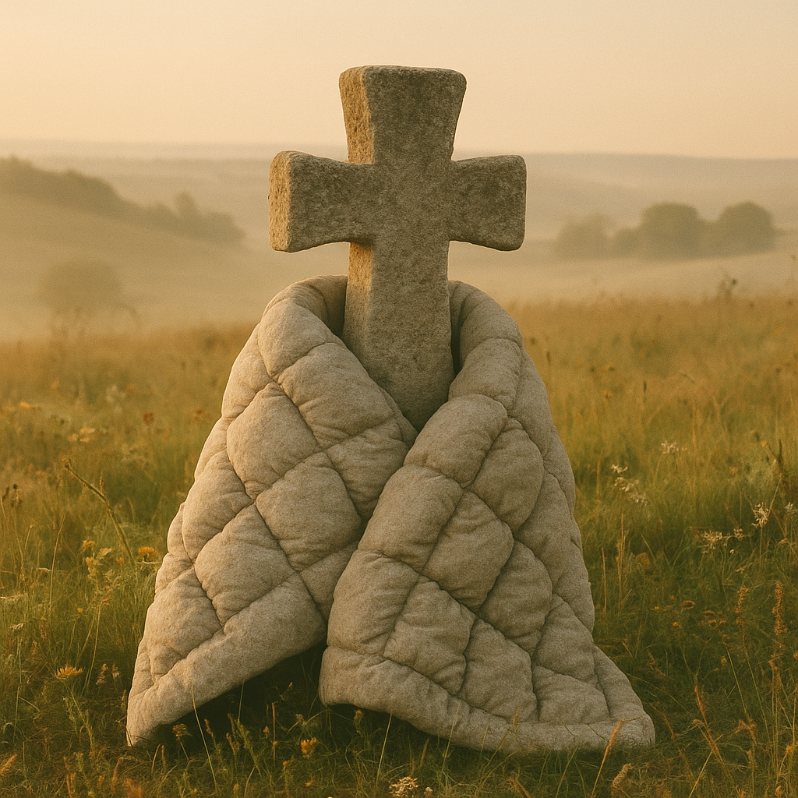
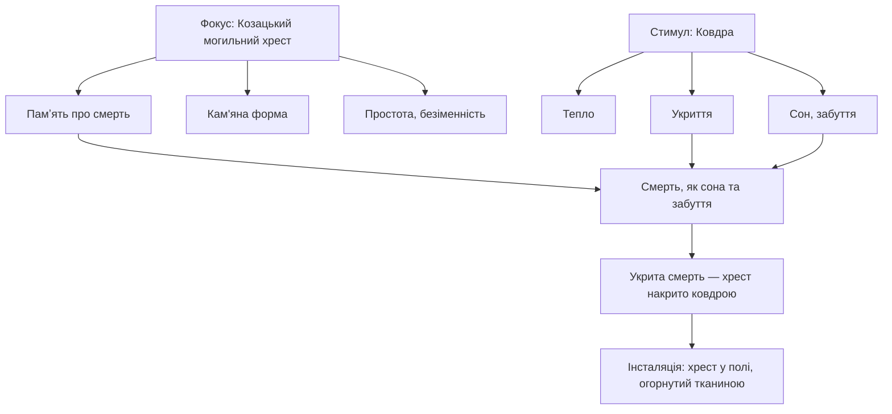

М’яка ковдра огортає старий могильний козацький хрест. Тяглість історичної традиції козацьких поховань та сучасна смерть цивільного або військового підчас нічних обстрілів. Мине час та сучасні пам'ятники також стануть давніми спогадами, але лишиться спогад про смерть, що прийшла вночі.

# Бісоціації

