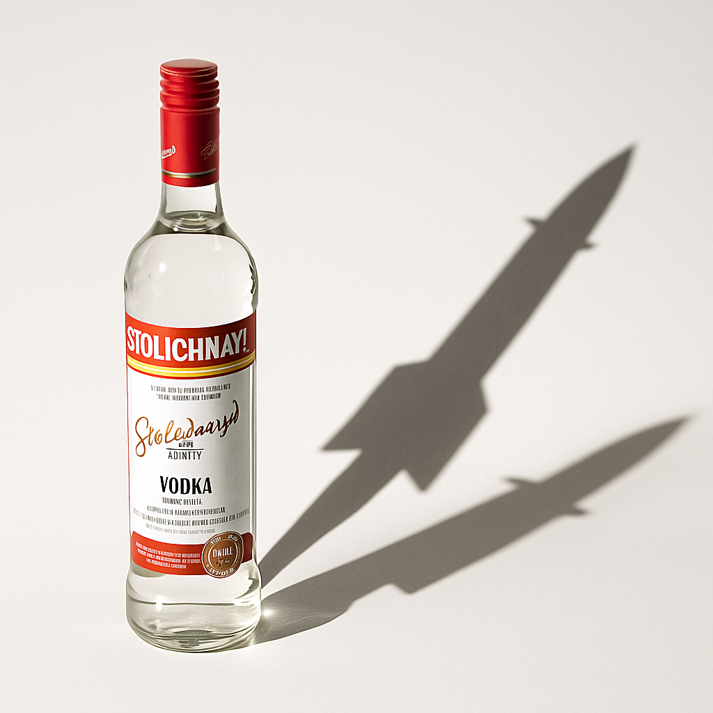
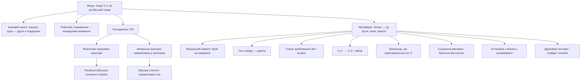

Хоч я і не прихильник перекладати відповідальність на споживача, але така ідея також має місце: якщо ти купуєш російські товари, то в «подарунок» отримуєш військові злочини в Бучі, Маріуполі, Ізюмі. Чудово, якби така акція з'явилась в європейських супермаркетах — це б щоденно нагадувало про те, що чинить їх мовчазна бездіяльність.

# Бісоціації

