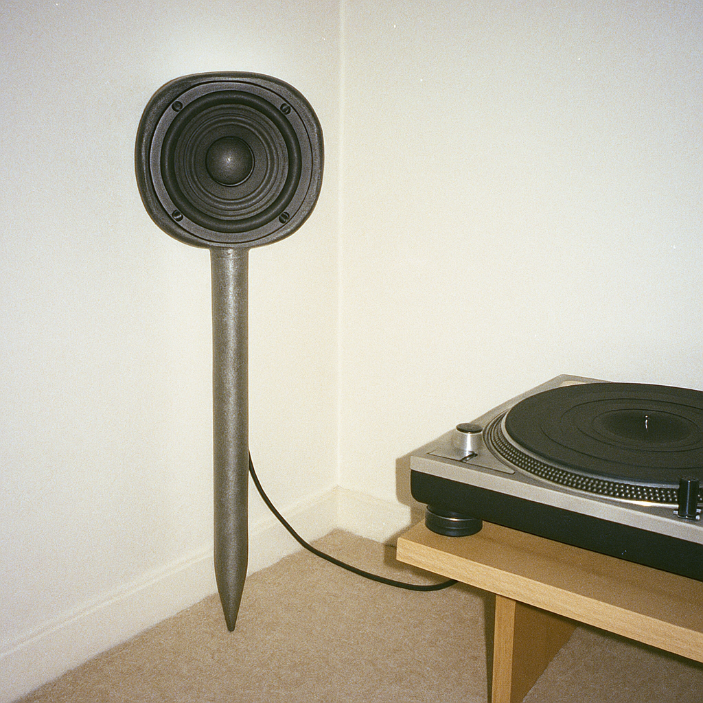
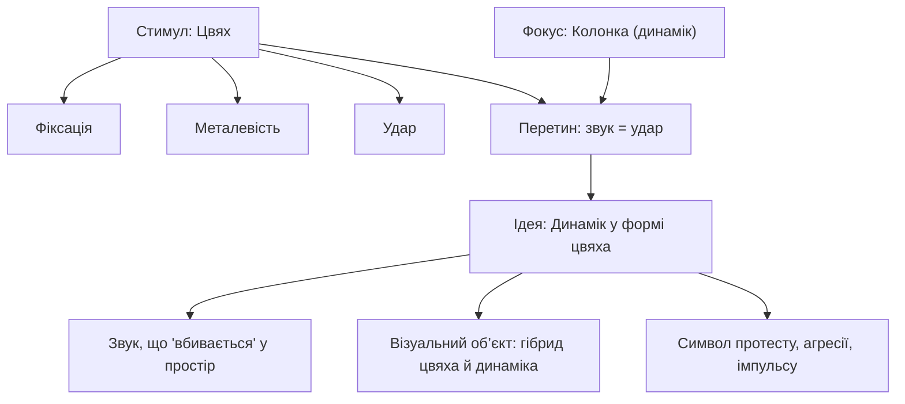

Динамік у формі цвяха, де верхня частина (шаляпка) — закритий металевою сіткою динамік або відкритий з класичною мембраною динамік, нижня частина — гостра ножка цвяха. У нього є очевидний недолік — цей динамік не дуже врівноважений, може надійно обпертись хіба що об стіну (краще дві), але для любителів дивних пристроїв та брутальних метафор — саме те.

# Бісоціації

