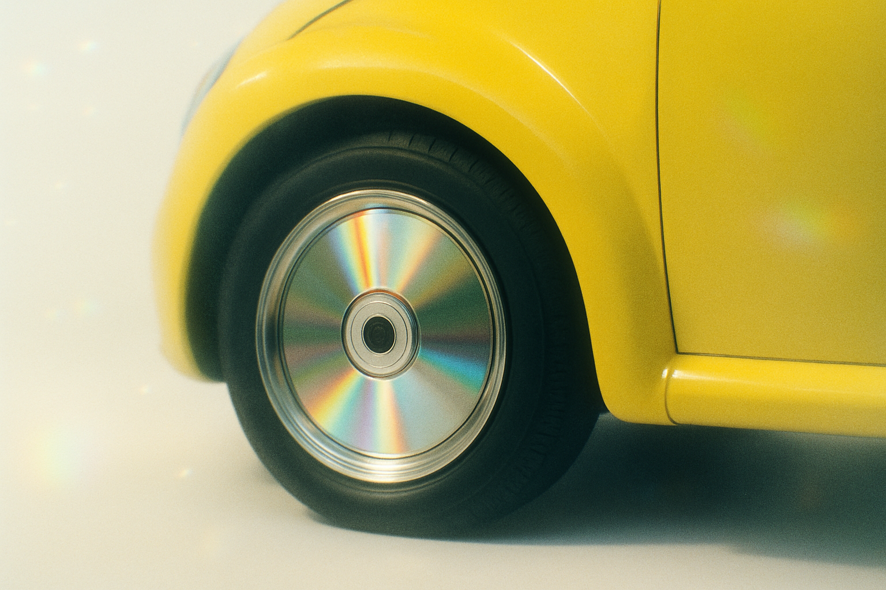
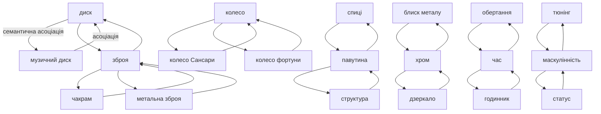

Найтупіший каламбур цього року — сіді-рім. Автомобільний диск у формі диску. І не треба мені казати, що таке вже хтось робив, це ж не повний привід, аби не публікувати ідею.

# Бісоціації

```mermaid
graph TD
    A["диск"] -->|семантична асоціація| B["музичний диск"]
    B -->|асоціація| A

    C["колесо"] --> D["колесо Сансари"]
    D --> C

    C --> E["колесо фортуни"]
    E --> C

    F["спиці"] --> G["павутина"]
    G --> F

    G --> H["структура"]
    H --> G

    I["блиск металу"] --> J["хром"]
    J --> I

    J --> K["дзеркало"]
    K --> J

    L["обертання"] --> M["час"]
    M --> L

    M --> N["годинник"]
    N --> M

    A --> O["зброя"]
    O --> A

    O --> P["чакрам"]
    P --> O

    O --> Q["метальна зброя"]
    Q --> O

    R["тюнінг"] --> S["маскулінність"]
    S --> R

    S --> T["статус"]
    T --> S


```
