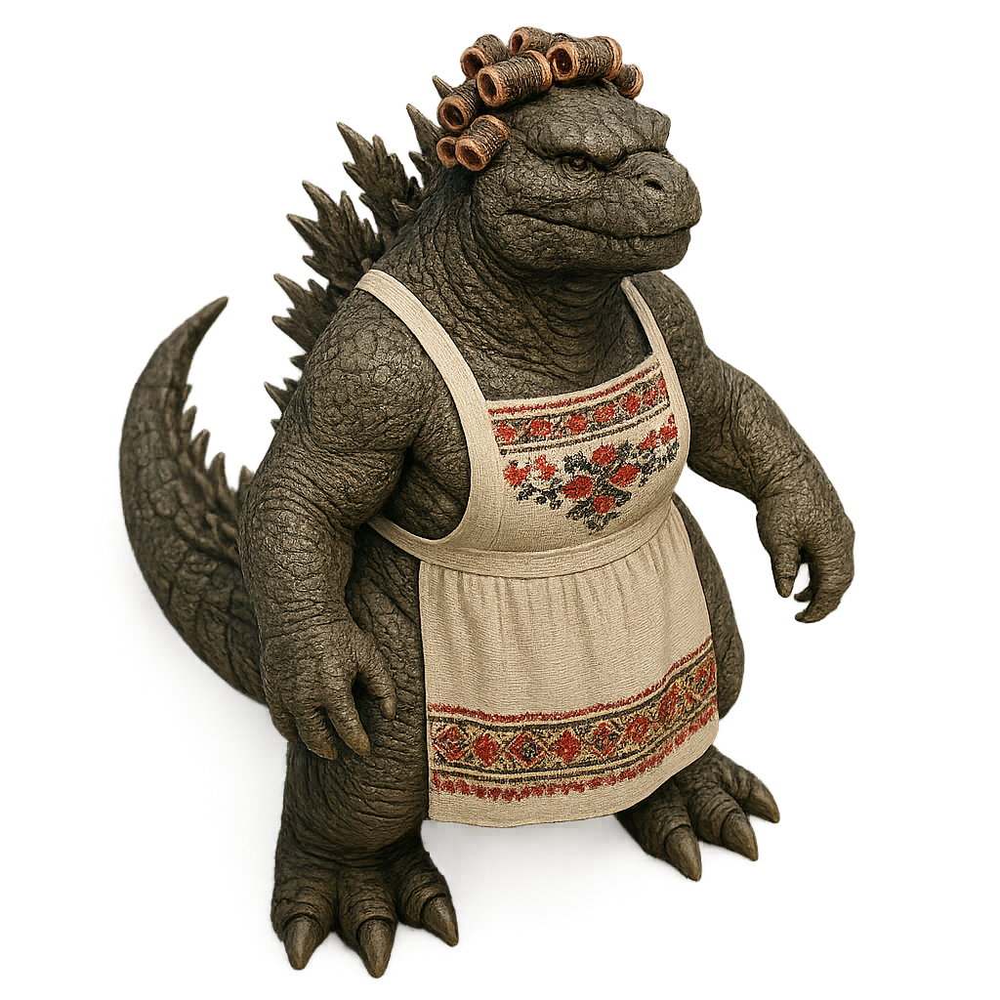
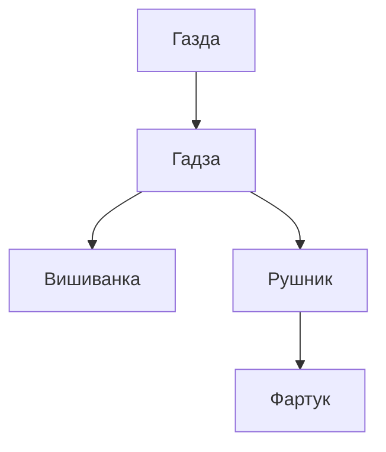

Газдиня — це західноукраїнський діалект, що означає господарка або господиня. Каламбур вийшов зранку за кавою випадково, коли моя дівчина просто омовилась. Тому всі кредітси належать їй.

# Бісоціації

