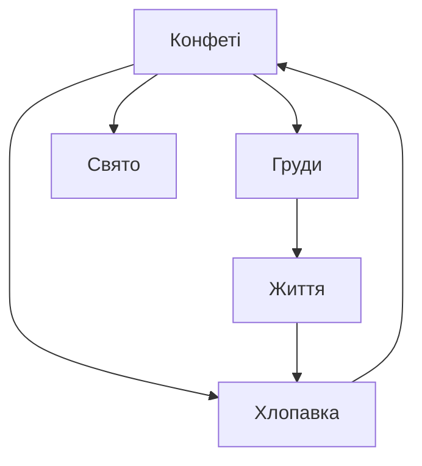

Конфеті, на яких намальовані соски. В рамках політики публічних генеративних моделей я не можу намалювати точний концепт, але уявіть реалістичний сосок на кожному із конфеті й тоді ідея стане ясною... як мамині груди для немовляти у вересневий понеділок.

# Бісоціації

