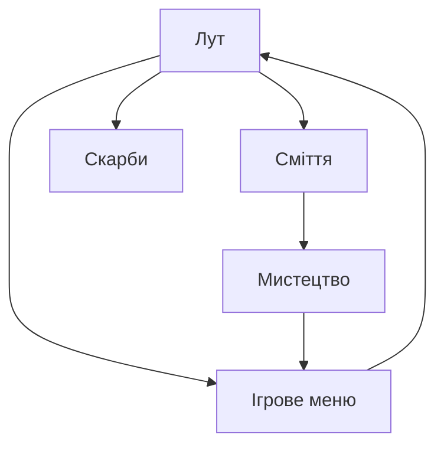

Веб-архів вкрадених росіянами артефактів під час війни в Україні. Ідея полягає в тому, аби без складних графіків та хітмапів показати масштаб розкрадання українського надбання на прикладі одного солдата й того, скільк б він міг винести на собі. В подальшому перетворити це на документальне підтвердження. Що, якщо зобразити вкрадене мистецтво та українські цінності у вигляді інтерактивного інветаря. Таким чином користувач зможе за допомогою доречної ігрової механіки додавати цінні речі в HUD і в режимі реального часу слідкувати за тим, як змінюються показники.

# Бісоціації

