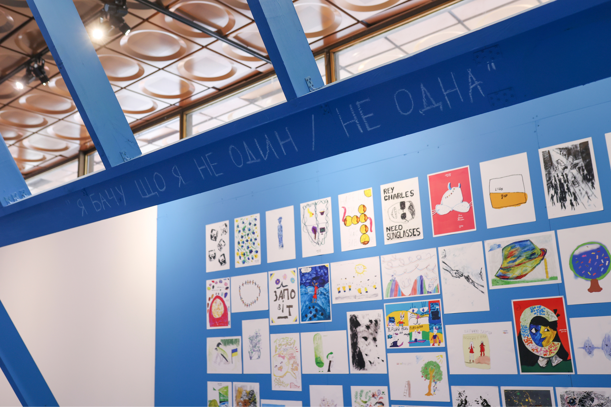
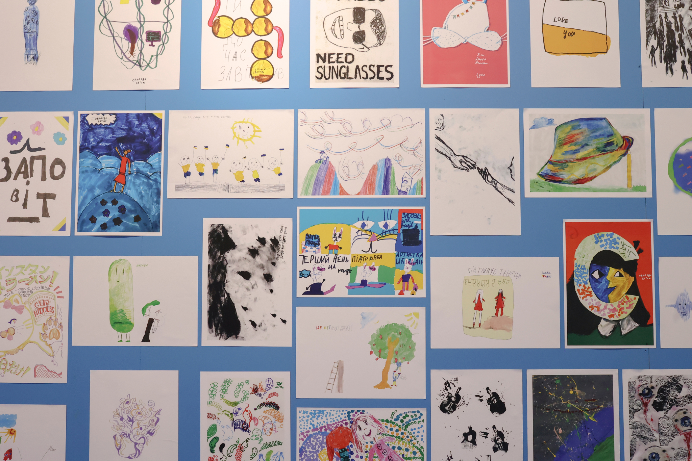
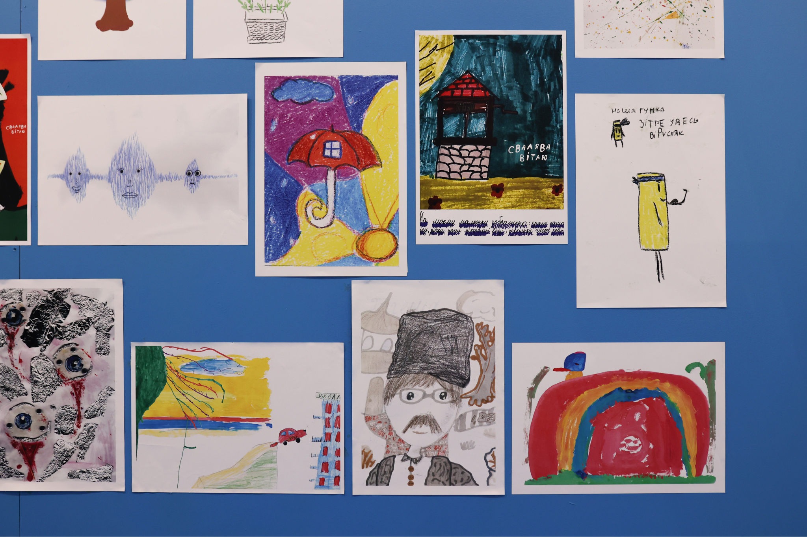

# Про мій досвід майстерок

Влітку 2023 року мені пощастило опинитися в дитячому таборі в Чернігові, який організував фонд ЮНІСЕФ. Часу було небагато, тож я вирішив не вигадувати велосипед і взяв готовий матеріал із дистанційної програми КалАртс. Втретє мені пощастило, коли я згодом отримав змогу викладати цей самий модуль у громадах по всій країні, переважно на сході та південному сході.

<iframe width="100%" height="315" src="https://www.youtube.com/embed/W02tpVJ5mHI?si=uS3WXH5H4MfOU1_o" title="YouTube video player" frameborder="0" allow="accelerometer; autoplay; clipboard-write; encrypted-media; gyroscope; picture-in-picture; web-share" referrerpolicy="strict-origin-when-cross-origin" allowfullscreen></iframe>

З цього досвіду народилися сотні дивовижних, уявних і по-справжньому оригінальних робіт.

Фото з виставки в Українському домі в Києві.

# Нові теми

Повернувшись у Київ, я розширив список тем, які мене цікавлять. Наразі зосередився на чотирьох із них.

## 1. Паперові комп'ютери та системна творчість

Системна творчість — це оксиморон чи спосіб подолати проблему білого аркуша й створити щось по-справжньому нове? Мета цієї майстерки в ігровій формі показати, що винаходити та вигадувати ідеї — це не якісь ексклюзивні знання й точно не «рокетсаєнс». Трохи поговоримо про незаслужено рідкісний термін «паперові комп'ютери» та як їх будувати.

[Фото та відео з минулої майстерки](https://www.instagram.com/p/DRQJTfhDYQg/?igsh=bGRxbHQ0YmU4ZzZw)

## 2. Дизайн-критика

Чому ми такі охочі рознести чиюсь роботу і як навчитися критикувати екологічно? Чи можна справді зрозуміти, який намір мав автор зображення, і як методично покращувати його так, щоб це було конструктивно та спонукало людину з іншого боку до розвитку? Як не плакати в подушку після кожної правки або, навпаки, не стати тим самим злодієм за кадром, який каже: «Всьо хуйня, Міша, давай поновой.»?

## 3. Дизайн для суспільних змін

Чи хочете ви й далі змушувати людей купувати те, що їм не потрібно, за гроші, яких у них немає, аби вразити тих, кому байдуже? Чи, можливо, створювати щось корисне для людей та саме те, що їм потрібно? Скажу відверто: поки не знаю деталей цієї майстерки. Але впевнений, що бачу це як настільну гру й дискусією про рівність і доступність у найширшому сенсі цього слова.

## 4. Створення зображень без референсів

В інтернеті — мільйони зображень, ілюстрацій та картин на будь-яку тему. А ще цей сраний штучний інтелект, який намалює тобі «як Пікассо». І виникає просте питання: навіщо я знову це роблю? Якщо все вже вигадано, а ми ходимо по колу, то як із нього вийти? І чи взагалі можна? Як створювати зображення без референсів? Як перестати копіювати одне одного й нарешті знайти свій власний стиль?